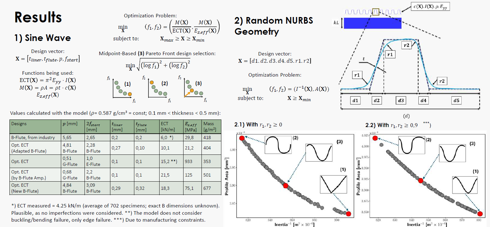

<h1 align="center">Opt_CB: Optimization of Corrugated Boards via NURBS Geometry and Multi-Objective Metaheuristics</h1>

<div align="center">
  <span class="author-block">
    <a href="https://github.com/ricardofitas">Ricardo Fitas</a>
  </span>
</div>

$~$

<p align="center">
  <!-- Placeholder: replace with an overview figure of the corrugated board optimization pipeline -->
  
</p>

## 🎯 Overview

This repository contains research code for the **optimization of corrugated board geometries** using:

- **NURBS-based parameterizations** of the flute profile
- **Analytical and numerical mechanics formulations** for effective properties
- **Multi-objective metaheuristics** (MOPSO, NSGA-II, etc.) and post-processing tools

The goal is to explore trade-offs between **mechanical performance** (stiffness, classification, effective properties) and **material usage / geometry** for corrugated boards.

> ⚠️ **License reminder**  
> This repository is distributed under a **source-available, no-modification license**.  
> Please read [LICENSE.txt](./LICENSE.txt) carefully before using the code.

---

## ✨ Highlights

- 🌀 **NURBS-based flute geometry**  
  Parameterizes the corrugated core as a smooth NURBS curve, with distances and radii encoded in a compact design vector.

- 📐 **Effective property and classification analysis**  
  Scripts for computing effective orthotropic properties, mass, inertia, and **classification** of optimized boards into categories (A–G, etc.), suitable for engineering studies.

- 🎯 **Multi-objective optimization engine**  
  Standalone implementations of **Multi-Objective Particle Swarm Optimization (MOPSO)** and **NSGA-II**, adapted for corrugated board design spaces.

- 🧱 **Geometry export to CAD / meshing tools**  
  Utilities to export flute geometries to **STL** (and example Gmsh geometry generation) for downstream FEM and CAD workflows.

- 🔬 **Research-oriented, script-based workflow**  
  The code is structured as **explicit research scripts**, making the full pipeline transparent for academic inspection.

<p align="center">
  <!-- Placeholder: replace with a figure showing geometry parametrization or Pareto front -->
  
</p>

---

## 📁 Project Structure

```text
.
├── Optimization_CB_v2.py             # NURBS-based corrugated board optimizer (core analytical formulation)
├── Optimization_CB_v2_prod.py        # Production-oriented optimizer with smoothing, plotting, and post-processing hooks
├── Optimization_CB_v2_sine.py        # Baseline sinusoidal-wave profile optimization
├── Optimization_CB_v2_sq.py          # Square-wave profile variant
├── Optimization_CB.py                # Early analytical formulation / reference implementation
├── Optimization_CB_2_liners.py       # Optimizations for 2-liner configurations
├── Optimization_CB_rand_nurbs.py     # Experiments with randomized NURBS initializations
│
├── OCB_analysis.py                   # Post-processing & classification of optimized designs (A–G classes, etc.)
├── OCB_analysis_prod_fix.py          # Extended/production-ready analysis with NURBS reconstruction
│
├── MOPSO_v3.py                       # Standalone multi-objective PSO engine
├── MOPSO_v3_2_liners.py              # MOPSO variant targeting 2-liner geometries
├── MOPSO_nurbs.py                    # MOPSO driver tailored to NURBS-based flute profiles
│
├── MOETPSO/                          # Multi-objective evolutionary & PSO utilities
│   ├── MOPSO.py                      # Generic MOPSO implementation
│   ├── NSGA.py                       # NSGA-II implementation (DEAP-based)
│   ├── FEM.py                        # Gmsh-based FEM geometry/meshing prototype
│   ├── EPSO_analysis.py              # EPSO/PSO result aggregation and scaling utilities
│   ├── GVRP.py                       # Additional optimization utilities / experiments
│   └── Paper_combinations_CB.py      # Paper configuration & feature scaling helper
│
├── STL/
│   ├── stl.py                        # Convert 2D flute curve to extruded 3D STL geometry
│   ├── local_curve_1.txt             # Sample local curve input
│   ├── local_curve_2.txt
│   ├── local_curve_3.txt
│   ├── 1.png                         # Placeholder renderings of sample geometries
│   ├── 2.png
│   └── 3.png
│
├── Drawing_curves.py                 # Utilities for plotting generated profiles
├── nurbs_vs_fillet_geometry.py       # Comparison between NURBS curve and filleted CAD geometry
├── profile_drawing.py                # Additional profile drawing helpers
├── test1_NURBS.py                    # Simple NURBS experiments / sanity checks
├── test_effective_calc.py            # Checks for effective property calculations
├── weight_inertia.py                 # Mass and inertia computations for board configurations
│
├── LICENSE.txt                       # Source-available, no-modification license
└── README.md                         # This file
```

> 📌 **Note on figures**  
> All images referenced under `figures/` are **placeholders**.  
> You can later add real figures (e.g., geometry examples, Pareto fronts, FEM snapshots) at those paths.

---

## 🛠️ Installation

### 1. Clone the repository

```bash
git clone https://github.com/ricardofitas/Opt_CBv2.git
cd Opt_CBv2
```

(If the folder name differs locally, adjust the path accordingly.)

### 2. Python environment

A modern scientific Python stack is required (Python **3.10+** recommended).  
A typical setup using `venv`:

```bash
python -m venv .venv
source .venv/bin/activate  # On Windows: .venv\Scripts\activate
```

### 3. Core dependencies

At minimum, you will need:

- `numpy`
- `scipy`
- `sympy`
- `matplotlib`
- `pandas`
- `geomdl` (for NURBS curves)

Install them via:

```bash
pip install numpy scipy sympy matplotlib pandas geomdl
```

### 4. Optional / advanced dependencies

Some scripts additionally rely on:

- `gmsh` (via the `gmsh` Python API) — geometry + meshing prototypes (`MOETPSO/FEM.py`)
- `cadquery` — CAD-style comparison of NURBS vs filleted geometries (`nurbs_vs_fillet_geometry.py`)
- `shapely` — geometric operations (`Optimization_CB_rand_nurbs.py`)
- `deap` — evolutionary algorithms (NSGA-II in `MOETPSO/NSGA.py`)
- `scikit-learn` — scaling / preprocessing (`MOETPSO/Paper_combinations_CB.py`)

Install them only if you intend to run the corresponding scripts:

```bash
pip install gmsh cadquery shapely deap scikit-learn
```

---

## ⚙️ Configuration & Parameters

Most scripts are configured directly by editing **top-level variables** in the Python files. Typical parameters include:

- **Geometry / NURBS parameters**
  - Distances `d1`–`d5` along the wavelength
  - Flute wavelength `lambda_`
  - Amplitude `Amp`
  - Radii / weights for fillet-like features

- **Material / mechanical parameters**
  - Elastic constants of liners and flute
  - Thicknesses of each layer
  - Target classification ranges

- **Optimization parameters**
  - Population size / swarm size
  - Number of iterations
  - Inertia / cognitive / social coefficients (for PSO)
  - Mutation / crossover probabilities (for NSGA-II)

> 💡 For now, parameter tuning is done **directly in the scripts** (e.g. in `Optimization_CB_v2_prod.py`, `MOPSO_nurbs.py`, `MOETPSO/MOPSO.py`, `MOETPSO/NSGA.py`).  
> A dedicated YAML/JSON configuration layer can be introduced later if desired.

---

## 🚀 Basic Usage

Below is a minimal set of typical workflows. You can extend this section as the project stabilizes.

### 1. Run a NURBS-based optimization (single script)

For a baseline optimization using the main formulation:

```bash
python Optimization_CB_v2_prod.py
```

This typically:

1. Builds the NURBS flute profile from a design vector `X`.
2. Computes equivalent mechanical properties / objective functions.
3. Runs an optimization loop (e.g. via PSO or local search).
4. Produces curves, intermediate results, and summary metrics.

### 2. Multi-objective optimization with MOPSO / NSGA-II

Use the MOPSO/NSGA drivers for more advanced multi-objective runs:

```bash
python MOPSO_nurbs.py          # NURBS + MOPSO coupling
python MOETPSO/MOPSO.py        # Generic MOPSO implementation
python MOETPSO/NSGA.py         # NSGA-II via DEAP
```

These scripts explore trade-offs such as:

- Stiffness vs mass
- Classification grade vs geometric constraints
- Robustness vs performance

### 3. Post-process and classify results

Once optimization runs have exported CSVs with candidate designs, use:

```bash
python OCB_analysis.py
python OCB_analysis_prod_fix.py
```

These scripts:

- Parse CSV results (e.g. from EPSO/MOPSO runs)
- Reconstruct or interpret geometry if needed
- Classify designs into predefined **board classes** (A–G) based on effective property ranges
- Export processed results to CSV/XLSX

### 4. Export geometries to STL

To generate simple STL geometry from a stored 2D curve:

```bash
cd STL
python stl.py
```

Configure the top of `STL/stl.py`:

- `INPUT_FILE` – path to `local_curve_*.txt`
- `OUTPUT_STL` – output file name
- `N_REPETITIONS`, `EXTRUSION_HEIGHT`, etc.

---

## 🧭 Quick-Start Tutorial (placeholder)

> 📝 **This is the section you mentioned you’ll describe in more detail later.**  
> Below is a lightweight skeleton you can overwrite or expand.

### Step 1 — Choose / define your design variables

- Decide which script matches your study (e.g. `Optimization_CB_v2_prod.py` for single-board optimization, `MOPSO_nurbs.py` for multi-objective).
- Inspect the design vector `X` and geometry parameters (`lambda_`, `Amp`, distances `d1`–`d5`, radii / weights).
- Adjust the **bounds** and **initial guesses** to match your design space.

### Step 2 — Configure objectives and constraints

- Open the optimization script and locate the **objective functions** (e.g. stiffness, mass, classification score).
- Enable or disable certain objectives (for PSO/NSGA) as needed for your case study.
- Adjust constraint checks (e.g. minimum thickness, geometric limits).

### Step 3 — Run an optimization campaign

- Launch the script from the command line (see examples above).
- Monitor convergence information printed to the console or written to CSV files.
- Optionally, store intermediate results (e.g. Pareto fronts, best individuals) per iteration.

### Step 4 — Analyze and visualize results

- Use `OCB_analysis*.py` to classify and clean the optimization output.
- Plot flute profiles and Pareto fronts using built-in plotting sections or your own notebooks.
- Export selected designs to `STL` (via `STL/stl.py`) for further CAD/FEM analysis.

You can replace this text with a more detailed mini-tutorial once your final workflow is fixed.

---

## 📁 Output Files (Typical)

Depending on the script and configuration, you may obtain:

- **Optimization outputs**
  - `Iteration_*.csv` files storing candidate designs and objective values
  - Per-run folders (e.g. `EPSO0/`, `EPSO1/`, etc.) with raw results

- **Post-processed data**
  - `output.csv`, `output.xlsx` files from `OCB_analysis*.py` with:
    - Design variables
    - Effective properties
    - Classification labels

- **Geometry exports**
  - STL files generated in `STL/` (e.g. `corrugator3b.stl`)
  - Optional PNG plots of curves if enabled in `stl.py` or plotting scripts

- **Figures (placeholders for now)**
  - Planned location: `figures/*.png` for:
    - Overview diagrams
    - Geometry snapshots
    - Pareto fronts / classification maps

---

## 📊 Example: A- and B-Flute Effective Stiffness (CMT/FCT surrogate)

To illustrate how to use the homogenization routine `Optimization_CB.calculate_ez`, we compute the expected through-thickness and in-plane stiffnesses for two standard flute geometries:

- **A-flute**: pitch 8.55 mm, height 4.75 mm  
- **B-flute**: pitch 6.45 mm, height 2.50 mm  

The function signature is:

```python
from Optimization_CB import calculate_ez

Ezeff, Eyeff, th = calculate_ez(X)
```

where `X = [t_liner, t_flute, pitch, height]` is given in **meters**.

### A-flute: 8.55 mm pitch, 4.75 mm height

We evaluate:

```python
from Optimization_CB import calculate_ez

X_A = [0.0002, 0.0002, 0.00855, 0.00475]
Ezeff_A, Eyeff_A, th_A = calculate_ez(X_A)
print(Ezeff_A, Eyeff_A, th_A)
```

Result:

- `Ezeff_A = 24_871_527.327246647 Pa  ≈ 2.487 × 10⁷ Pa  (≈ 24.9 MPa)`
- `Eyeff_A = 433_222_151.62266856 Pa ≈ 4.332 × 10⁸ Pa (≈ 433.2 MPa, ≈ 0.43 GPa)`
- `th_A    = 5.339178017788088e-06 m ≈ 5.34 μm` (effective homogenized thickness)

### B-flute: 6.45 mm pitch, 2.50 mm height

We evaluate:

```python
from Optimization_CB import calculate_ez

X_B = [0.0002, 0.0002, 0.00645, 0.0025]
Ezeff_B, Eyeff_B, th_B = calculate_ez(X_B)
print(Ezeff_B, Eyeff_B, th_B)
```

Result:

- `Ezeff_B = 22_180_643.83644492 Pa  ≈ 2.218 × 10⁷ Pa  (≈ 22.2 MPa)`
- `Eyeff_B = 700_678_066.5402967 Pa  ≈ 7.007 × 10⁸ Pa (≈ 700.7 MPa, ≈ 0.70 GPa)`
- `th_B    = 2.9016740773635114e-06 m ≈ 2.90 μm` (effective homogenized thickness)

### Interpretation (CMT / FCT perspective)

Within this model, `Ezeff` acts as a **through-thickness stiffness proxy**, which can be related to **FCT/CMT-type responses** under linear-elastic assumptions, while `Eyeff` captures the effective in-plane stiffness in the cross direction.

For identical paper parameters:

- A-flute shows a **slightly higher through-thickness stiffness** (`Ezeff`) than B-flute.  
- B-flute shows a **higher in-plane stiffness** (`Eyeff`) due to its more compact geometry.

These values provide a quantitative starting point for comparing flute geometries before calibrating against experimental CMT/FCT data.

---

## 📜 License

This repository is licensed under a **custom source-available, no-modification license**.

You are allowed to:

- View and read the source code.
- Cite this software (or its DOI, if provided) in academic work.

You are **not** allowed to:

- Modify, adapt, or debug this software.
- Redistribute this code or any modified version.
- Use this software for commercial purposes.
- Integrate any part of this code into other software projects.

For full legal terms, please refer to [LICENSE.txt](./LICENSE.txt).  
To request extended permissions, please contact the author (see below).

---

## 📧 Contact

For questions, collaboration, or permission requests, please contact:

- **Author**: Ricardo Fitas  
- **Email**: rfitas99@gmail.com  
- **GitHub**: [@ricardofitas](https://github.com/ricardofitas)
- **LinkedIn**: [Ricardo Fitas](https://www.linkedin.com/in/ricardo-fitas-167bba164/)

If you use or reference this code in academic work, please consider citing the corresponding publications once available.
